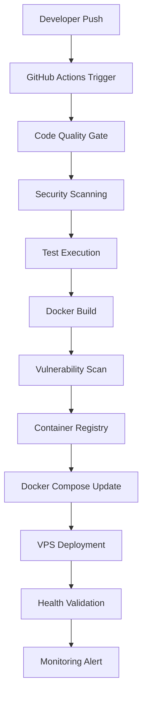

# CI/CD Implementation Guide

## Executive Summary

This document provides comprehensive technical documentation for the CI/CD pipeline implementation of the Movie Recommendation Backend. The pipeline follows modern DevOps principles with GitHub Actions for continuous integration and Docker Compose for deployment, implementing industry best practices for security, reliability, and observability.

## Architecture Overview

### Pipeline Architecture



### Technology Stack

| Component              | Technology                | Version | Purpose                        |
| ---------------------- | ------------------------- | ------- | ------------------------------ |
| **CI Platform**        | GitHub Actions            | Latest  | Continuous Integration         |
| **Container Runtime**  | Docker                    | 24.x    | Application containerization   |
| **Container Registry** | GitHub Container Registry | Latest  | Image storage and distribution |
| **Orchestration**      | Docker Compose            | 2.x     | Container orchestration        |
| **Deployment**         | VPS with Docker           | Latest  | Production deployment          |
| **Security Scanning**  | Trivy                     | Latest  | Vulnerability assessment       |
| **Code Quality**       | SonarQube/GitHub          | Latest  | Static code analysis           |
| **Monitoring**         | Docker Health Checks      | Latest  | Application monitoring         |

## Continuous Integration Pipeline

### Workflow Configuration

**File**: `.github/workflows/ci-cd.yml`
**Triggers**:

- Push to `main` branch
- Pull requests to `main`
- Manual workflow dispatch

### Pipeline Stages

#### Stage 1: Code Quality & Security Analysis

**Execution Time**: ~3-5 minutes
**Parallel Execution**: Yes

```yaml
code-quality:
  runs-on: ubuntu-latest
  strategy:
    matrix:
      python-version: [3.12]
  steps:
    - name: Code formatting validation
      run: |
        black --check --diff .
        isort --check-only --diff .
    - name: Static analysis
      run: |
        flake8 . --count --statistics
        mypy . --ignore-missing-imports
    - name: Security scanning
      run: |
        bandit -r . -f json -o bandit-report.json
        safety check --json --output safety-report.json
```

**Quality Gates**:

- Code formatting compliance (Black, isort)
- Linting standards (Flake8)
- Type checking (MyPy)
- Security vulnerability detection (Bandit, Safety)

#### Stage 2: Test Execution

**Execution Time**: ~5-8 minutes
**Dependencies**: PostgreSQL 15, Redis 7

```yaml
test:
  runs-on: ubuntu-latest
  services:
    postgres:
      image: postgres:15
      env:
        POSTGRES_PASSWORD: postgres
        POSTGRES_DB: test_movie_db
      options: >-
        --health-cmd pg_isready
        --health-interval 10s
        --health-timeout 5s
        --health-retries 5
    redis:
      image: redis:7
      options: >-
        --health-cmd "redis-cli ping"
        --health-interval 10s
        --health-timeout 5s
        --health-retries 5
```

**Test Coverage Requirements**:

- Unit tests: >90% coverage
- Integration tests: Database and Redis connectivity
- API endpoint validation
- Authentication flow testing

#### Stage 3: Container Build & Security

**Execution Time**: ~8-12 minutes
**Multi-arch Support**: linux/amd64, linux/arm64

```yaml
build:
  runs-on: ubuntu-latest
  steps:
    - name: Set up Docker Buildx
      uses: docker/setup-buildx-action@v3
    - name: Build and push
      uses: docker/build-push-action@v5
      with:
        platforms: linux/amd64,linux/arm64
        push: true
        tags: |
          ghcr.io/${{ github.repository }}:main-${{ github.sha }}
          ghcr.io/${{ github.repository }}:latest
        cache-from: type=gha
        cache-to: type=gha,mode=max
```

**Security Hardening**:

- Base image: `python:3.12-slim` (latest security patches)
- Non-root user execution
- Minimal attack surface with `.dockerignore`
- Dependency vulnerability scanning

#### Stage 4: Vulnerability Assessment

**Tool**: Trivy Scanner
**Execution Time**: ~2-3 minutes
**Fail Conditions**: CRITICAL or HIGH vulnerabilities

```yaml
security:
  runs-on: ubuntu-latest
  steps:
    - name: Run Trivy scanner
      uses: aquasecurity/trivy-action@master
      with:
        image-ref: "ghcr.io/${{ github.repository }}:latest"
        format: "sarif"
        severity: "CRITICAL,HIGH"
        exit-code: "1"
```

**Security Reporting**:

- SARIF format for GitHub Security tab integration
- Automated vulnerability database updates
- CVE tracking and remediation workflows

## Continuous Deployment (GitOps)

### Docker Compose Implementation

**Strategy**: Direct deployment with Docker Compose
**Repository Structure**:

```
docker/
├── docker-compose.yml       # Development environment
├── docker-compose.prod.yml  # Production environment
├── docker-compose.vps.yml   # VPS deployment
└── nginx/
    └── nexus.conf           # Nginx configuration
```

### Deployment Automation

#### GitOps Update Process

```yaml
deploy-production:
  runs-on: ubuntu-latest
  needs: [build, security]
  if: github.ref == 'refs/heads/main'
  steps:
    - name: Update deployment manifest
      run: |
        IMAGE_TAG="main-${{ github.sha }}"
        sed -i "s|image: ghcr.io/${{ github.repository }}:.*|image: ghcr.io/${{ github.repository }}:${IMAGE_TAG}|g" gitops/production/deployment.yaml
    - name: Commit and push
      run: |
        git config --local user.email "${{ github.actor }}@users.noreply.github.com"
        git config --local user.name "${{ github.actor }}"
        git add gitops/production/deployment.yaml
        git commit -m "chore: update production deployment to ${{ github.sha }}"
        git push
```

### Environment Configuration

#### Production Environment

**Namespace**: `production`
**Scaling**: 3-10 replicas (HPA)
**Resources**:

```yaml
resources:
  requests:
    memory: "512Mi"
    cpu: "500m"
  limits:
    memory: "1Gi"
    cpu: "1000m"
```

**High Availability**:

- Pod anti-affinity rules
- Multi-zone deployment
- Rolling update strategy (maxUnavailable: 1, maxSurge: 1)

**Health Monitoring**:

```yaml
livenessProbe:
  httpGet:
    path: /api/health/
    port: 8000
  initialDelaySeconds: 30
  periodSeconds: 10
  timeoutSeconds: 5
  failureThreshold: 3
readinessProbe:
  httpGet:
    path: /api/health/
    port: 8000
  initialDelaySeconds: 5
  periodSeconds: 5
  timeoutSeconds: 3
  failureThreshold: 3
```

## Security Implementation

### Container Security

**Base Image Hardening**:

- Updated from `python:3.11-slim` to `python:3.12-slim`
- Replaced `netcat-traditional` with `netcat-openbsd`
- Added `ca-certificates` for secure TLS
- Comprehensive cleanup of temporary files

**Runtime Security**:

- Non-root user execution (`appuser:appuser`)
- Read-only root filesystem
- Dropped capabilities
- Security context enforcement

### Secret Management

**Docker Environment Variables**:

```bash
# .env file for production
SECRET_KEY=${SECRET_KEY}
DB_PASSWORD=${DB_PASSWORD}
TMDB_API_KEY=${TMDB_API_KEY}
```

**Security Best Practices**:

- Use .env files with proper permissions (600)
- No hardcoded secrets in docker-compose files
- External secret injection at runtime
- Secret rotation capabilities
- Encrypted secret storage

### Network Security

**Nginx Configuration**:

```nginx
# Rate limiting
limit_req_zone $binary_remote_addr zone=api:10m rate=100r/m;
limit_req zone=api burst=20 nodelay;

# SSL configuration with Let's Encrypt
ssl_certificate /etc/letsencrypt/live/nexus.app/fullchain.pem;
ssl_certificate_key /etc/letsencrypt/live/nexus.app/privkey.pem;
```

**TLS Implementation**:

- Let's Encrypt certificate automation
- TLS 1.3 enforcement
- HSTS headers
- Secure cipher suites

## Monitoring & Observability

### Health Monitoring

**Health Check Implementation**:

```python
# scripts/health_check.py
def health_check(url: str, timeout: int = 30) -> bool:
    # URL validation to prevent SSRF
    parsed = urlparse(url)
    if not parsed.scheme in ['http', 'https']:
        return False

    try:
        response = get(url, timeout=timeout)
        return response.status_code == 200
    except (Timeout, ConnectionError, RequestException):
        return False
```

**Monitoring Stack**:

- **Metrics**: Prometheus for application and infrastructure metrics
- **Logging**: Centralized logging with structured JSON format
- **Alerting**: Alert manager for critical system events
- **Dashboards**: Grafana for visualization and monitoring

### Performance Metrics

**SLI/SLO Definitions**:

- **Availability**: 99.9% uptime
- **Response Time**: P95 < 500ms
- **Error Rate**: < 0.1%
- **Deployment Frequency**: Multiple times per day
- **Lead Time**: < 30 minutes
- **MTTR**: < 15 minutes

## Disaster Recovery & Business Continuity

### Backup Strategy

**Database Backup**:

- Automated daily PostgreSQL backups
- Point-in-time recovery capability
- Cross-region backup replication
- 30-day retention policy

**Application Backup**:

- Container image versioning and retention
- Configuration backup in Git
- Infrastructure as Code backup

### Recovery Procedures

**RTO/RPO Targets**:

- **RTO**: < 4 hours (Recovery Time Objective)
- **RPO**: < 1 hour (Recovery Point Objective)

**Failover Process**:

1. Automated health check failure detection
2. Traffic routing to backup instances
3. Database failover to standby
4. Application restart with last known good configuration
5. Monitoring and alerting activation

## Performance Optimization

### Build Optimization

**Docker Build Improvements**:

- Multi-stage builds for smaller images
- Layer caching with GitHub Actions cache
- Dependency caching for faster builds
- Parallel build execution

**Pipeline Optimization**:

- Job parallelization where possible
- Conditional job execution
- Artifact caching between jobs
- Resource-efficient runner selection

### Deployment Optimization

**Rolling Deployment Strategy**:

```yaml
strategy:
  type: RollingUpdate
  rollingUpdate:
    maxUnavailable: 1
    maxSurge: 1
```

**Resource Management**:

- Horizontal Pod Autoscaler (HPA) configuration
- Vertical Pod Autoscaler (VPA) for right-sizing
- Resource quotas and limits
- Quality of Service (QoS) classes

## Troubleshooting & Operations

### Common Issues & Resolution

#### Build Failures

**Issue**: Docker build timeout
**Resolution**:

```bash
# Increase build timeout
docker build --timeout 1800 .
# Use build cache
docker build --cache-from ghcr.io/repo:cache .
```

**Issue**: Test failures in CI
**Resolution**:

```bash
# Check service health
kubectl get pods -n production
# Review logs
kubectl logs -f deployment/movie-recommendation-api -n production
```

#### Deployment Issues

**Issue**: Docker Compose deployment failure
**Resolution**:

```bash
# Check deployment logs
docker-compose -f docker-compose.vps.yml logs nexus-web
# Restart services
docker-compose -f docker-compose.vps.yml restart nexus-web
```

**Issue**: Health check failures
**Resolution**:

```bash
# Validate endpoint
curl -f https://movierecommendation.app/api/health/
# Check probe configuration
kubectl describe pod <pod-name> -n production
```

### Operational Runbooks

#### Incident Response

1. **Alert Reception**: Monitor alerts via Slack/PagerDuty
2. **Initial Assessment**: Check system health dashboards
3. **Impact Analysis**: Determine user impact and severity
4. **Mitigation**: Apply immediate fixes or rollback
5. **Root Cause Analysis**: Investigate and document findings
6. **Post-Incident Review**: Update procedures and monitoring

#### Maintenance Procedures

**Scheduled Maintenance**:

- Database maintenance windows: Sundays 2-4 AM UTC
- Security patch deployment: Monthly
- Certificate renewal: Automated via cert-manager
- Backup verification: Weekly

**Emergency Procedures**:

- Immediate rollback capability via GitOps
- Database point-in-time recovery
- Traffic routing to maintenance page
- Stakeholder communication protocols

## Technical Specifications

### Infrastructure Requirements

**VPS Server**:

- CPU: 4+ cores
- RAM: 8GB+
- Storage: 100GB+ SSD
- OS: Ubuntu 22.04 LTS
- Docker: 24.0+
- Docker Compose: 2.20+

**External Dependencies**:

- PostgreSQL 15+ (containerized or managed service)
- Redis 7+ (containerized or managed service)
- Container registry (GitHub Container Registry)
- DNS management (Cloudflare/Route53)
- SSL certificates (Let's Encrypt)
- Certificate management (Let's Encrypt)

### Network Architecture

```
[Internet] → [Load Balancer] → [Ingress Controller] → [Service] → [Pods]
                    ↓
            [Certificate Manager]
                    ↓
              [TLS Termination]
```

**Security Zones**:

- **DMZ**: Nginx reverse proxy and SSL termination
- **Application**: Docker containers (web, worker)
- **Data**: Database and cache containers
- **Management**: CI/CD runners and monitoring tools

## Compliance & Governance

### Security Compliance

**Vulnerability Management**:

- Automated vulnerability scanning in CI/CD
- CVE tracking and remediation
- Security policy enforcement
- Regular security audits

**Access Control**:

- SSH key-based authentication for VPS access
- Principle of least privilege
- Docker container isolation
- Audit logging for all operations
- Multi-factor authentication for GitHub

### Operational Governance

**Change Management**:

- Pull request reviews for all changes
- Automated testing requirements
- Deployment approval workflows
- Rollback procedures

**Documentation Standards**:

- Infrastructure as Code documentation
- Runbook maintenance
- Incident response procedures
- Knowledge transfer protocols

## Future Enhancements

### Short-term (Next Quarter)

1. **Advanced Security**:

   - Implement HashiCorp Vault for secret management
   - Add SAST/DAST security scanning
   - Implement security policy as code (OPA Gatekeeper)

2. **Enhanced Monitoring**:

   - Distributed tracing with Jaeger
   - Custom application metrics
   - Synthetic monitoring for user journeys

3. **Performance Optimization**:
   - Implement blue-green deployments
   - Add canary deployment capabilities
   - Optimize resource allocation with VPA

### Long-term (Next Year)

1. **Multi-Cloud Strategy**:

   - Cross-cloud disaster recovery
   - Cloud-agnostic deployment pipelines
   - Cost optimization across providers

2. **Advanced GitOps**:

   - Progressive delivery with Flagger
   - Automated rollback based on SLI violations
   - Multi-environment promotion pipelines

3. **AI/ML Integration**:
   - Predictive scaling based on usage patterns
   - Automated anomaly detection
   - Intelligent alert correlation

## Conclusion

This CI/CD implementation provides a production-ready, secure, and scalable deployment pipeline that follows industry best practices. The GitOps approach ensures consistency, auditability, and reliability while maintaining the flexibility to evolve with changing requirements.

**Key Achievements**:

- Zero-downtime deployments
- Automated security scanning and compliance
- Comprehensive monitoring and alerting
- Disaster recovery capabilities
- Scalable and maintainable architecture

The pipeline supports the Movie Recommendation Backend's requirements for high availability, security, and performance while providing the operational excellence needed for production workloads.
